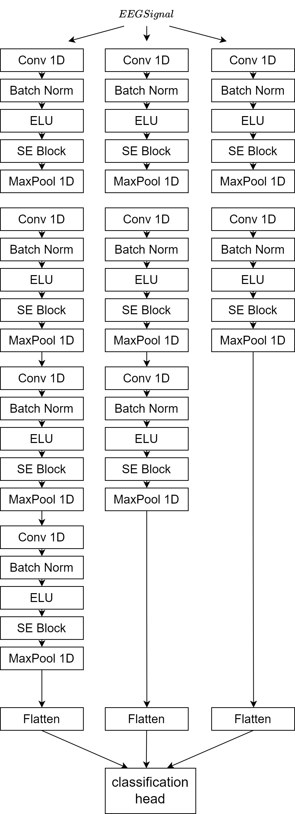
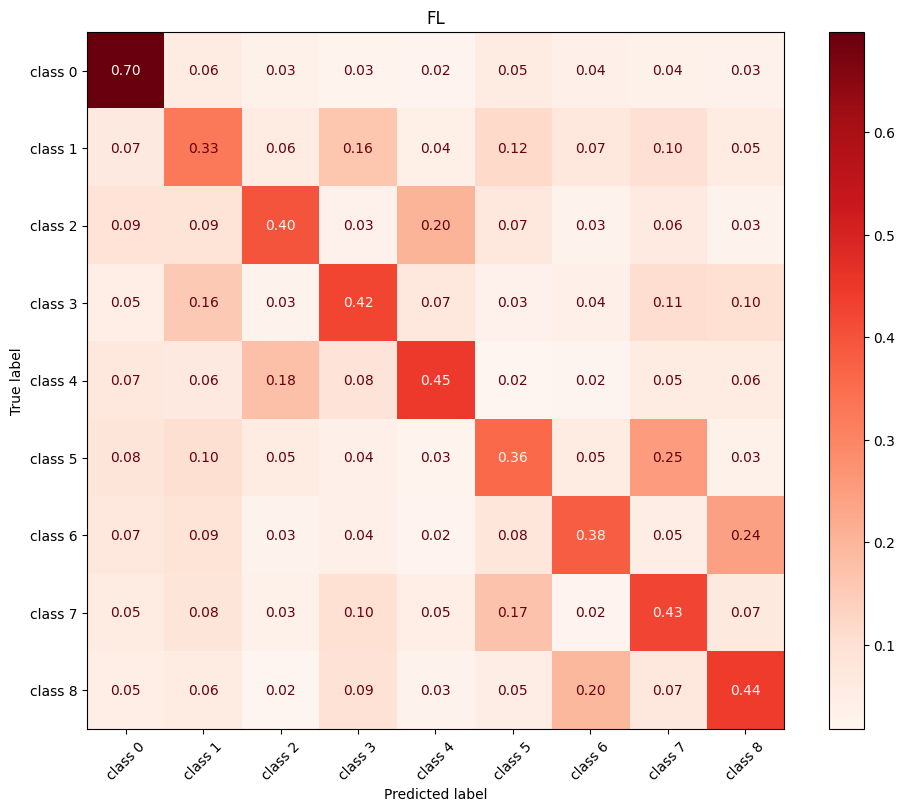
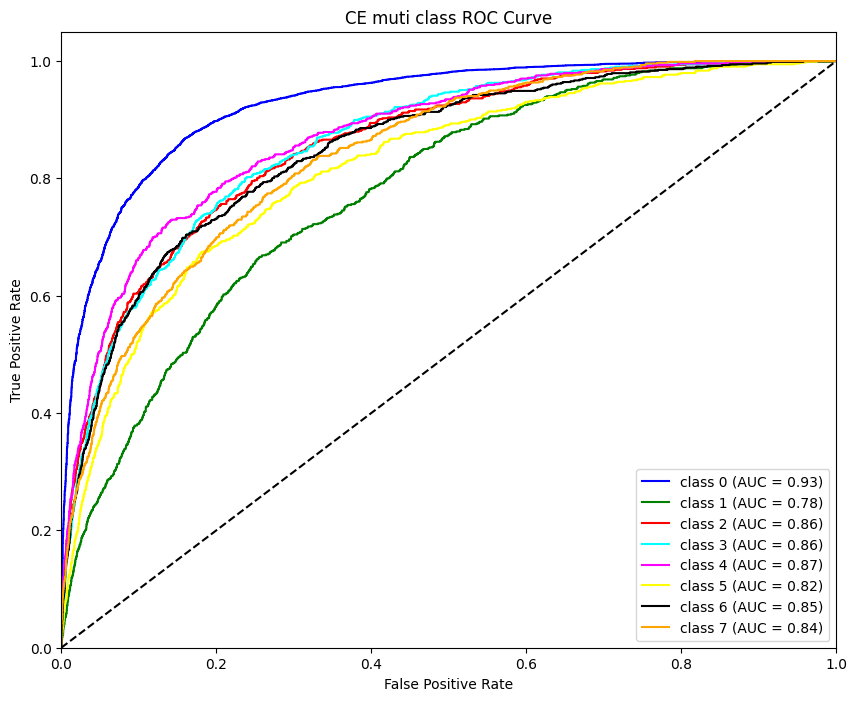
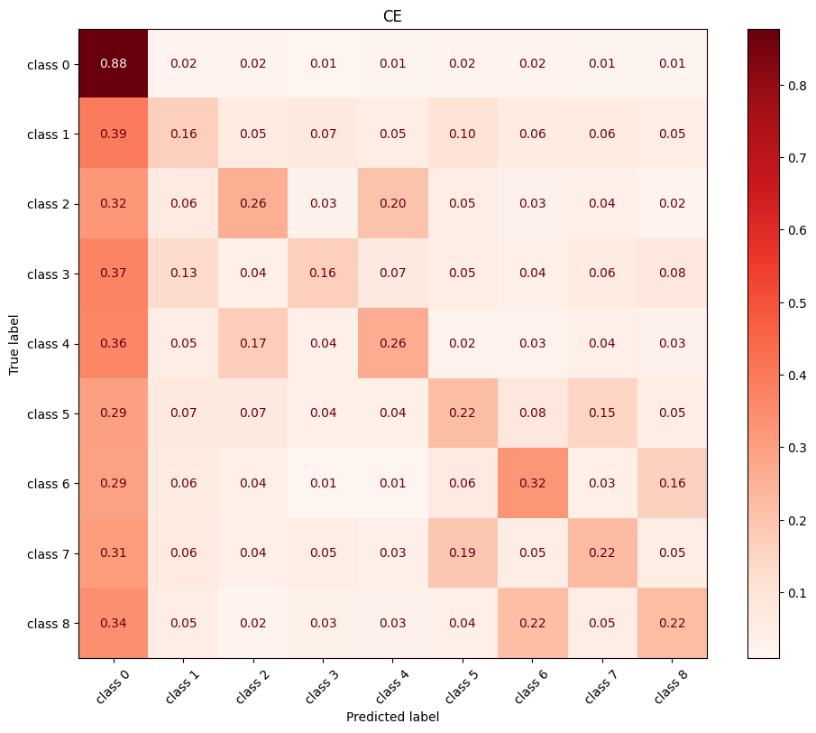
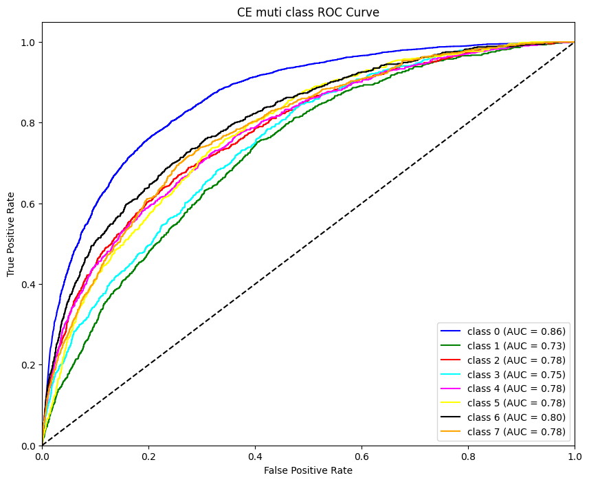

# 1.数据预处理

### a.数据切片

PhysioNet EEG运动/意象数据集使用BCI2000系统获取，并可通过[EEG Motor Movement/Imagery Dataset v1.0.0](https://physionet.org/content/eegmmidb/1.0.0/)免费获取。

该数据集包括来自109名受试者的1500多个EEG记录，每个记录持续一到两分钟。每个被试共参与14个实验，实验分为五种类型：基线跑（睁眼和闭眼）、打开和关闭左拳或右拳、想象打开和关闭左拳或右拳、打开和关闭双拳或双脚、想象打开和关闭双拳或双脚。每个实验共包括29个试验，每个试验持续约4秒。信号采样率为160hz，信号通道数为64路。

对于EEG运动/图像数据集，除每个受试者的前两个一分钟基线任务（睁眼和闭眼）外，每个信号需要根据29个试验的类别进行分割，并且每个分割的片段应分配给特定的类别。总共可以有多达9个类别，包括：T0（休息），意象双拳，意象双脚，运动双拳，运动双脚，意象左拳，意象右拳，运动左拳和运动右拳。此外，考虑到被试反应速度的内在差异性，为保证数据维度的一致性，每次试验只保留前4秒，即640个样本点。

### b.数据去噪

为了去除数据中存在的环境与生理伪影，我们设计并应用了独立成分分析联合小波去噪方法，去噪流程如图所示：

去噪效果如图所示：

## 2.模型架构与训练策略

### a.模型架构

模型架构如图所示：

该模型是一种端到端的深度学习模型，专门用于解码原始运动想象（Motor Imagery, MI）脑电图（EEG）信号，无需复杂的预处理（如滤波或时频变换）。核心架构为：

- **三个独立分支**，分别设计不同深度和卷积核尺寸，以提取多尺度、多层次的时序特征：
  - **Branch 1**: 6层卷积，卷积核尺寸 **20**
  - **Branch 2**: 5层卷积，卷积核尺寸 **13**
  - **Branch 3**: 4层卷积，卷积核尺寸 **15**

每个分支通过1D卷积层、批归一化（BatchNorm）、ELU激活函数和最大池化（MaxPool1D，步长=2）逐步降采样

### b.训练策略

核心问题为：

- **类别严重失衡**：数据分布为[13705, 1711, 1724, 1696, 1715, 1709, 1694, 1716, 1710]，最大类别是其他类别的8倍
- **典型场景**：医疗影像、工业检测等需要小样本类别高精度的场景

##### 第一阶段训练策略（基础特征学习）

1. **训练目标**：建立基础特征表示
2. **训练特点**：

- **全参数训练**：`list(model.parameters())`包含所有层参数
- **基础损失函数**：标准交叉熵损失
- **原始数据分布**：保持原始数据加载器（未重采样）
- **典型学习曲线**：CE值快速下降

##### 第二阶段训练策略（分类器微调）

1. **训练目标**：优化小类别识别能力

2. **使用重采样技术**：最大类别采样概率降低约4倍，实现动态平衡采样（每个epoch采样分布不同）

3. **参数冻结**：仅训练分类器层（`model.classifier`）

   

## 3.实验结果

### a.我们的模型

### b.FFCL(Li, H., Ding, M., Zhang, R., & Xiu, C. (2022). Motor imagery EEG classification algorithm based on CNN-LSTM feature fusion network. *Biomedical signal processing and control*, *72*, 103342.)

