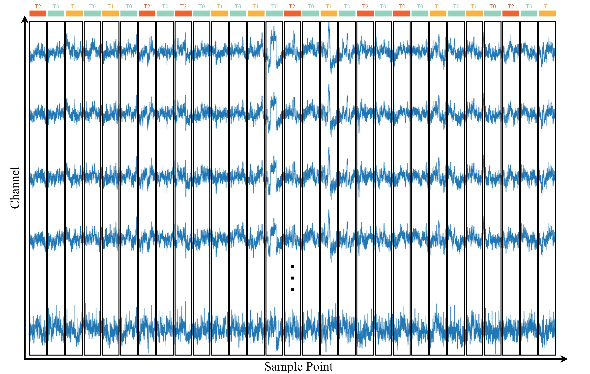

# 1.数据预处理

### a.数据切片

PhysioNet EEG运动/意象数据集使用BCI2000系统获取，并可通过[EEG Motor Movement/Imagery Dataset v1.0.0](https://physionet.org/content/eegmmidb/1.0.0/)免费获取。

该数据集包括来自109名受试者的1500多个EEG记录，每个记录持续一到两分钟。每个被试共参与14个实验，实验分为五种类型：基线跑（睁眼和闭眼）、打开和关闭左拳或右拳、想象打开和关闭左拳或右拳、打开和关闭双拳或双脚、想象打开和关闭双拳或双脚。每个实验共包括29个试验，每个试验持续约4秒。信号采样率为160hz，信号通道数为64路。

对于EEG运动/图像数据集，除每个受试者的前两个一分钟基线任务（睁眼和闭眼）外，每个信号需要根据29个试验的类别进行分割，并且每个分割的片段应分配给特定的类别。总共可以有多达9个类别，包括：T0（休息），意象双拳，意象双脚，运动双拳，运动双脚，意象左拳，意象右拳，运动左拳和运动右拳。此外，考虑到被试反应速度的内在差异性，为保证数据维度的一致性，每次试验只保留前4秒，即640个样本点。

### b.数据去噪

为了去除数据中存在的环境与生理伪影，我们设计并应用了独立成分分析联合小波去噪方法，去噪流程如图所示：

去噪效果如图所示：

## 2.实验结果

### a.九分类混淆矩阵

### b.ROC曲线

